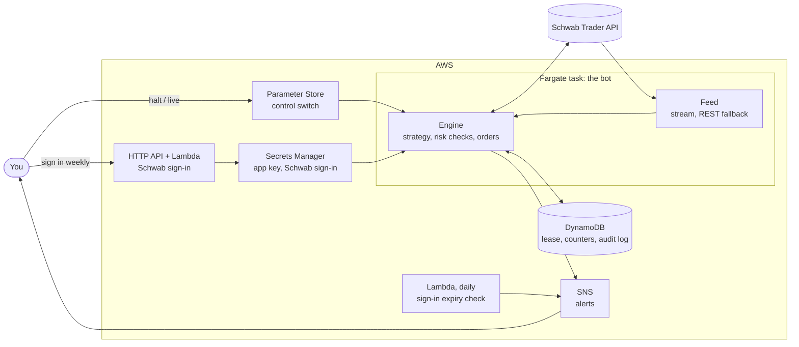

# traider

A rule-based trading bot for one Schwab brokerage account. It runs as a single
always-connected container on AWS Fargate, listens to Schwab's market-data stream,
and places orders through the Schwab Trader API when your strategy asks for them.
All infrastructure is defined with Pulumi.

It starts in **paper mode**: real market data, simulated fills, nothing sent to
Schwab. Real orders need two separate switches, both set by you.

> **Read this first**
>
> - This is software for placing real trades with real money. It can lose money,
>   through its own bugs, your strategy, or events nobody planned for. Nothing here is
>   financial advice.
> - The strategy that ships with it (`sma_cross`) is a placeholder that makes the
>   plumbing do something visible. It has no demonstrated edge. What to trade, and
>   whether to trade at all, is your decision.
> - It has **never been run against the real Schwab API or a real AWS account**. See
>   [What has and has not been verified](#what-has-and-has-not-been-verified).

## How it works



- **The strategy** turns bars and quotes into *targets*: "hold N shares of X". It
  never sees the broker.
- **The engine** compares each target with what the broker says you hold, builds the
  order for the difference, runs it through the risk checks and sends it. It wakes on
  every quote from the stream, so it reacts in well under a second, plus the time
  Schwab takes to accept an order. This is not a high-frequency system.
- **The same engine** runs in backtests, in paper mode and live. Only the broker
  behind it changes.

## Safety rules

These are enforced in code and each has tests that fail if the rule stops working.

| Rule | What it means |
| --- | --- |
| Two switches for live | The stack must be deployed with `tradingMode: live` **and** the control parameter must say `live`. Either one alone does nothing. |
| Kill switch | Set the control parameter to `halt` and the bot stops ordering and cancels its working orders, normally within 10 to 15 seconds; longer if Schwab or AWS is slow, and cancelling needs a working Schwab sign-in. `close_only` allows sells only. If the switch cannot be read for a minute, the bot halts itself. |
| Small hard limits | Per-order, per-position and total exposure caps, a daily order count, a daily loss limit that stops new buys, a cooldown, and checks for wide spreads, stale or frozen quotes and halted securities. Defaults are deliberately small (500 / 1000 / 2000 dollars). |
| Long only, cash only | It never shorts and, by default, never borrows: a buy must be covered by cash that no other order of the bot's has claimed, and not by money from a sale that has yet to settle (see [Settled cash](#settled-cash)). |
| The broker is the truth | Positions are read from the broker before every order. The bot keeps no position book of its own to drift out of step. |
| Never resend on doubt | If an order's fate is unknown (a timeout, a lost reply), the bot does not send it again. It looks the order up and waits for the position to show what happened. Only after a minute in which the broker shows no such order and the position has not moved does it treat the order as never placed. If things do not add up it freezes the symbol and alerts you. |
| One bot at a time | A lease in DynamoDB lets exactly one instance trade or touch orders, and it is re-checked right before each order. Deploys stop the old task before starting the new one. |
| Fail closed | No control value, no lease, no market hours, no fresh account data, no usable quote, no valid sign-in: no order. |
| A new day starts clean | What the strategy wanted yesterday is forgotten at midnight New York time. Nothing trades in the morning until the strategy has asked again. |
| Exits are not capped | The limits that stop the bot taking risk (size caps, order count, loss halt, cooldown) do not stop it selling what it holds. A sell still needs an open market, a fresh quote, the lease and a valid sign-in, like any order. |

### Settled cash

Money from a sale settles the next business day. In a **cash account**, buying with
it and selling again before it settles is a
[good-faith violation](https://www.schwab.com/learn/story/avoid-these-violations-when-trading-cash);
three in twelve months can get the account restricted to settled cash for 90 days.
The bot therefore keeps a running total of what it sold today and does not spend
that money again until tomorrow (`settled_cash_only`, on by default).

A **margin account** does not have this problem. `traider check` tells you which kind
you have, and you can then set `settled_cash_only: false` to let the bot reuse the
day's proceeds.

A sale counts from the moment the sell order goes out, not when it finishes, and on
the two days a year when markets trade but banks are shut (Columbus Day and Veterans
Day) the previous trading day's sales still count as unsettled.

Two things the bot cannot see: sales you make by hand in the same account, and
whether a recent deposit has cleared. Keep the bot's account to the bot.

The old pattern-day-trader rule (four day trades in five days, 25,000 dollar
minimum) was replaced in June 2026 by FINRA's intraday-margin rule
([Regulatory Notice 26-10](https://www.finra.org/rules-guidance/notices/26-10)), and
Schwab [said](https://www.schwab.com/learn/story/sec-approves-scrapping-25000-day-trader-minimum)
it would stop counting day trades. The bot has no rule for it. The new rule concerns
margin, which the bot does not use unless you turn `require_cash` off.

### Options

Off by default. Setting `allow_options: true` in `traider:risk` lets a strategy trade
**long calls and long puts** on the configured symbols: bought to open, sold to
close, one leg at a time. Nothing is ever written (sold short), so the most an
option position can lose is the premium paid for it. The Schwab account needs
options approval; without it Schwab rejects the orders.

What changes when a target names an option contract instead of a share symbol:

- **The dollar caps apply to the premium.** One contract is 100 shares, so a contract
  quoted at 2.10 counts as 210 dollars against `max_order_usd`, `max_position_usd`,
  `max_total_exposure_usd` and the cash rules. `max_contracts_per_order` caps the
  count. With the default 500 dollar order cap, that is two such contracts.
- **Limit orders only**, at the quoted price: buys at the ask, sells at the bid. An
  unfilled order is cancelled after `orderTimeoutS` and priced again.
- **Their own quote checks**: `max_option_spread_bps` and `min_option_price` replace
  the share limits, because option spreads are far wider. The quote must still be
  real-time and fresh.
- **No buying on the last day.** `min_days_to_expiry` (default 1) is the fewest days
  an option may have left when bought.
- **Sold before expiry.** On its last day an option is sold in the final hour
  (`option_expiry_exit_min`, default 60 minutes before the close), whatever the
  strategy says. This applies to every long option on a configured symbol in the
  account, not only ones the bot bought. You get one alert when the bot first sees
  such a holding that day, and repeated alerts during the final hour for as long
  as it is still in the account.

That last rule exists because of the one way a long option can cost more than its
premium: **an option left to expire in the money is exercised automatically**, which
buys (call) or sells (put) 100 shares per contract at the strike. No limit here is
sized for that. The exit is a limit order at the bid and can fail: no bid, a stale
quote, the control switch on `halt`, a lapsed sign-in. The alerts are sent whether
or not the bot is able to sell, but not if the bot is not running at all. If the
contracts are still in the account near the close, sell them or tell Schwab not to
exercise.

Other things to know:

- Option quotes are polled every `pollIntervalS` seconds, not streamed, so the bot
  reacts to option prices in seconds, not sub-second.
- A strategy picks contracts from `ctx.chain("SPY")`: bid, ask, delta and days to
  expiry for strikes around the money, reloaded once a minute
  (`traider:optionChainDays`, `traider:optionChainStrikes`).
- Turning `allow_options` off stops buys and the expiry exit. A strategy can still
  sell an option it names.
- A thinly traded contract can go minutes without a new quote. The frozen-quote
  check (`max_quote_lag_s`, 120 seconds) then blocks orders on it, sells included.
  Stick to liquid contracts or raise it.
- At most 20 contracts are tracked at once. Every contract a strategy names counts,
  even with a target of 0, until the next day; contracts actually in the account
  are always tracked.
- **Backtests do not cover options.** There is no historical option data in a bar
  file, so option targets in a backtest never trade.
- Option proceeds settle the next business day, like shares, and the
  [settled-cash](#settled-cash) rule covers them.

## What has and has not been verified

Verified, on the machine this was written on:

- More than 850 automated tests for the bot pass. They run it against an in-process
  fake of the Schwab API (sign-in, accounts, orders, quotes, price history, market
  hours, the streaming socket, and failures of each) and against a fake AWS.
- More than 100 tests run the Pulumi program against provider mocks and check what it
  would create: network rules, IAM policies down to the exact resource, the schedule,
  where secrets go, and that the example configuration matches the real defaults.
- Each safety rule was checked the other way round as well: the rule was broken on
  purpose, one at a time, to confirm a test notices.
- Lint, formatting and strict type checks pass. The Dockerfile's install steps were
  run in a clean directory, and the resulting command line starts.

Not verified. Treat each as something to watch on first contact:

- **No part of this has talked to the real Schwab API.** The client was written from
  Schwab's published behaviour as implemented by two open-source libraries
  (`schwab-py` and `schwabdev`). Field names, error formats and timing may differ in
  ways the fake does not capture. `traider check` is read-only and exists to be the
  first thing that touches the real API.
- **Options are the least proven part.** The option symbol format, the order
  instructions (`BUY_TO_OPEN`, `SELL_TO_CLOSE`), the chain and quote fields and how
  Schwab reports an option position are all taken from the same two libraries, and
  none of it has met the real API. Whether Schwab marks option quotes as real-time
  for your app decides whether the bot will trade them at all; with `allow_options`
  on, `traider check` reads a chain and one contract's quote and fails if the bot
  would refuse to trade on it. Paper
  trade options before anything else.
- **`pulumi up` has never been run.** The mocks prove the program is self-consistent
  and uses argument names the providers accept. They do not prove AWS accepts every
  value. Expect to fix something small on the first `pulumi preview`.
- **The container image has never been built** (no Docker registry was reachable).
  The CI workflow builds it for ARM and smoke-tests it on every push.
- **Schwab's callback address.** Sources disagree on whether Schwab accepts a
  callback that is not `https://127.0.0.1` for an individual developer's app. Both
  ways of signing in are built; see [the runbook](docs/runbook.md#signing-in).
- **Account details.** How your account reports available cash, and whether the
  sign-in survives exactly seven days, can only be seen on your account.
  `traider check` prints what the bot would see.
- **Paper results flatter.** Paper fills happen instantly at the quoted price, with no
  queueing, partial fills or market impact.

## Try it without any accounts

You need [uv](https://docs.astral.sh/uv/). Nothing here touches Schwab or AWS.

```sh
uv sync
uv run pytest                  # the bot's tests
uv run ruff check . && uv run mypy

# Replay your own one-minute bars through the real engine and risk checks.
# CSV columns: timestamp (ISO 8601 with a timezone, or Unix seconds), open, high,
# low, close, and optionally volume and symbol.
TRAIDER_SYMBOLS=SPY uv run traider backtest --csv bars.csv --symbol SPY
```

A backtest checks that a strategy and its limits behave the way you intended. It
does not predict live results.

## Deploy

You need: an AWS account and credentials that can create the resources, the AWS CLI
version 2, a current [Pulumi CLI](https://www.pulumi.com/docs/install/), Docker with
buildx, uv, and a Schwab brokerage account. The Schwab API is reported to need
thinkorswim enabled on the account. The AWS CLI must point at the same account and
region as the stack, or commands such as the kill switch will fail or miss.

> **The bot treats the whole position in every configured symbol as its own.** If the
> account already holds shares of a symbol you list, a live bot will sell them when
> the strategy says to hold none. Use an account, or symbols, that are the bot's alone.

**1. Create the stack.**

```sh
cd infra
pulumi login                 # Pulumi Cloud; or `pulumi login --local`
pulumi stack init dev
pulumi config set aws:region us-east-1
pulumi config set --path 'traider:symbols[0]' SPY
pulumi config set --path 'traider:symbols[1]' QQQ
pulumi config set traider:alertEmail you@example.com
# The placeholder strategy holds `position_usd` worth of each symbol (500 by default)
# and buys whole shares, so a share priced above that means it buys nothing. To see
# it trade symbols like these on paper, raise it and the caps that bound it:
pulumi config set --path traider:strategyParams.position_usd 1500
pulumi config set --path traider:risk.max_order_usd 1500
pulumi config set --path traider:risk.max_position_usd 1500
pulumi config set --path traider:risk.max_total_exposure_usd 3000
pulumi up
```

[`infra/Pulumi.example.yaml`](infra/Pulumi.example.yaml) lists every setting with its
default. `pulumi up` builds the image (for ARM; set `traider:cpuArchitecture` to
`X86_64` if your machine cannot; `pulumi preview` builds it too, so it needs Docker
as well), creates about 50 resources and starts the bot in paper mode. The first
deploy starts the task straight away whatever the time; the weekday schedule takes
over from the next 16:30 New York stop. AWS sends a confirmation email to the alert address: alerts start once
you click the link in it. With no Schwab credentials yet, the bot idles and says so.

**2. Register a Schwab developer app.** At <https://developer.schwab.com>, create an
individual developer app with the *Accounts and Trading Production* and *Market Data
Production* APIs. For the callback URL enter both of these, separated by a comma:

```sh
echo "$(pulumi stack output callbackUrl),https://127.0.0.1"
```

Wait until the app's status is **Ready For Use**. *Approved - Pending* is not enough,
and it can take a few days. If the portal refuses the first address, see
[the runbook](docs/runbook.md#if-schwab-will-not-accept-the-hosted-callback).

**3. Store the app key and secret.** They go straight into Secrets Manager. They are
never in the repository, the Pulumi state or the logs.

```sh
read -rs APP_KEY        # paste the key, press Enter (nothing is shown)
read -rs APP_SECRET     # paste the secret, press Enter
aws secretsmanager put-secret-value \
  --secret-id "$(pulumi stack output appSecretArn)" \
  --secret-string "$(printf '{"app_key":"%s","app_secret":"%s"}' "$APP_KEY" "$APP_SECRET")"
unset APP_KEY APP_SECRET
```

**4. Sign in to Schwab.** Open the sign-in link, log in at Schwab and approve access
for the one account the bot should use.

```sh
pulumi stack output reauthUrl --show-secrets
```

The link holds a key, so treat it like a password. A bot waiting for a sign-in
notices it within a minute; one that is renewing early, within five. There is
nothing to restart.

**5. Check what the bot would see.** This reads from Schwab and sends no orders.

```sh
pulumi stack output localEnv > ../.env     # settings and secret locations; no secrets
cd ..
uv run --env-file .env traider check
```

Read the output carefully. This is the first real contact with Schwab, and the
place where a wrong assumption shows up.

**6. Watch it paper trade.**

```sh
aws logs tail "$(cd infra && pulumi stack output logGroup)" --follow
```

Leave it in paper mode until you have watched it through whole sessions, including a
restart, a sign-in renewal and a `halt`. Then read
[Going live](docs/runbook.md#going-live).

## Operating it

[`docs/runbook.md`](docs/runbook.md) covers the kill switch, the weekly sign-in, what
each alert means and what to do about it, how to see what the bot did and why, and
the going-live checklist. The two things to know by heart:

```sh
# Stop trading now (takes effect within about 10 seconds):
aws ssm put-parameter --name /traider-dev/control --value halt --overwrite

# The Schwab sign-in lasts 7 days. An alert with the link arrives about two days
# before it lapses. If it lapses while the bot holds positions, it cannot sell them.
```

## Configuration

Stack settings live in `infra/Pulumi.<stack>.yaml` and are documented in
[`infra/Pulumi.example.yaml`](infra/Pulumi.example.yaml). Pulumi turns them into the
`TRAIDER_*` environment variables the bot reads (`src/traider/config.py`), and
validates them with the bot's own code during `pulumi preview`.

**Settings are versioned.** The first time a deployed bot starts it copies the stack's
settings into its settings table as version 1. From then on that table is the source:
every change is a new numbered version, the running bot applies it within about 10
seconds, and an alert lists what changed. `traider settings show | history | apply`
reads and writes it (see the [runbook](docs/runbook.md#restarting-changing-settings-tearing-down)).
Pinned symbols apply live: the bot watches a newly pinned symbol at once, and quotes
for it start once the feed follows the bot's universe. An unpinned symbol the bot still
holds stays managed until it is sold or the bot next restarts (every morning on the
schedule); sell it first or keep it pinned. A few fields (strategy, its parameters,
option-chain span, `allow_options`) wait for the next restart. Until the bot has read a valid version
it opens no new positions; after that, an unreadable table or a bad version leaves
the last good settings in force. `traider check` and `traider backtest` still use the
`TRAIDER_*` environment values, not the settings table.

To run the command line on your own machine against a deployed stack, use the
`localEnv` output as in step 5. It leaves out the trading mode and the control
switch on purpose, so nothing you run locally with it can send a live order. Do not
run `traider run` locally while the deployed bot is running: Schwab allows one
streaming connection per sign-in and the two would keep cutting each other off.

## Writing a strategy

A strategy is a class with one required method. It returns the position it wants;
the engine does the rest.

```python
# src/traider/strategy/my_strategy.py
from collections.abc import Sequence

from traider.models import Bar, Target
from traider.strategy.base import Strategy, StrategyContext


class MyStrategy(Strategy):
    name = "my_strategy"
    warmup_bars = 30  # one-minute bars replayed at start-up, before trading

    def on_bar(self, bar: Bar, ctx: StrategyContext) -> Sequence[Target]:
        held = ctx.position(bar.symbol)
        ...
        return [Target(bar.symbol, quantity=10, reason="why")]
```

Register it in `src/traider/strategy/__init__.py`, set `traider:strategy` to its
name, write tests for it, backtest it, then run it on paper. `on_quote` is also
available for decisions that cannot wait for the end of a bar.

With [options](#options) switched on, a target may name a contract instead of a
share symbol, and the quantity is then a number of contracts:

```python
        if any(held for symbol, held in ctx.positions.items() if symbol != bar.symbol):
            return []  # already in a contract
        calls = [c for c in ctx.chain(bar.symbol) if c.contract.right == "C"]
        picks = [c for c in calls if 20 <= c.days_to_expiry <= 40 and c.delta is not None]
        if picks:
            best = min(picks, key=lambda c: abs(c.delta - Decimal("0.5")))
            return [Target(best.symbol, quantity=1, reason="why")]
```

A target belongs to one contract and stands until the strategy changes it or the day
ends. Asking for a different contract does not cancel the first: a strategy that
names a new "best" contract on every bar ends up holding several. To close a
position, return a target of 0 for that contract's symbol; `ctx.positions` lists
what is held. Quotes for held contracts reach `on_quote` too.

Keep a strategy deterministic and free of I/O. On a restart it is rebuilt from
recent bars, and the engine only ever trades the difference between its target and
the real position, so a restart is harmless.

## Costs

Rough monthly cost in us-east-1, before tax and free tiers:

| | Weekday market hours (default) | Always on |
| --- | --- | --- |
| Fargate, 0.25 vCPU / 0.5 GB, ARM | $1.60 | $7.20 |
| Public IPv4 address | $0.80 | $3.65 |
| Secrets Manager, two secrets | $0.80 | $0.80 |
| Logs, DynamoDB, Lambda, API, alerts | under $0.50 | under $0.50 |
| **About** | **$3.50** | **$12** |

There is no NAT gateway (about $32 a month saved): the task has a public address and
a security group with no inbound rules and outbound HTTPS only.

## Development

```
src/traider/            the bot
  engine.py             the trading loop and its safety rules
  risk.py               pre-trade checks (pure functions)
  strategy/             strategies; sma_cross is the placeholder
  broker/               paper broker and Schwab broker behind one interface
  schwab/               Schwab client: OAuth, tokens, REST, stream, parsing
  state/                lease, counters and audit log (DynamoDB or in memory)
  lambdas/              sign-in endpoint and expiry watchdog
  cli.py                run | check | login | backtest
tests/                  unit tests, the fake Schwab server, whole-bot tests
infra/                  the Pulumi program (Python) and its tests
docs/runbook.md         operating instructions
```

```sh
uv sync && uv run pytest                      # the bot
cd infra && uv sync && uv run pytest          # the infrastructure, against mocks
```

Tests are written first and the suite treats warnings as errors. If you change a
safety rule, break it on purpose afterwards and make sure a test fails. If the bot
starts calling a new AWS API, add it to the task policy in `infra/bot.py`: the
policies name exact actions and resources.

## Limits worth knowing

- US equities and ETFs, whole shares, regular session only. No shorting, no extended
  hours. [Options](#options) are long single calls and puts only: no spreads, no
  covered calls, no selling to open.
- One Schwab account per stack.
- Bars are one minute. Quotes arrive faster and reach `on_quote`.
- The bot starts each weekday at 09:00 and stops at 16:30 New York time unless
  `alwaysOn` is set. On market holidays it starts, sees there is no session, and
  idles.
- After changing `alwaysOn`, run `pulumi up --refresh` so Pulumi sees how many tasks
  are really running.
