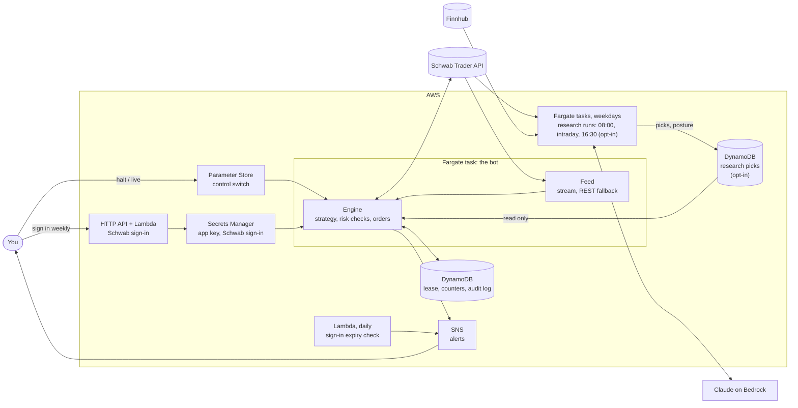

# traider

A rule-based trading bot for one Schwab brokerage account. It runs as a single
always-connected container on AWS Fargate, listens to Schwab's market-data stream,
and places orders through the Schwab Trader API when your strategy asks for them.
All infrastructure is defined with Pulumi.

It starts in **paper mode**: real market data, simulated fills, nothing sent to
Schwab. Real orders need two separate switches, both set by you.

> **Read this first**
>
> - This is software for placing real trades with real money. It can lose money,
>   through its own bugs, your strategy, or events nobody planned for. Nothing here is
>   financial advice.
> - The strategy that ships with it (`sma_cross`) is a placeholder that makes the
>   plumbing do something visible. It has no demonstrated edge. What to trade, and
>   whether to trade at all, is your decision.
> - It has **never been run against the real Schwab API or a real AWS account**. See
>   [What has and has not been verified](#what-has-and-has-not-been-verified).

## How it works



- **The strategy** turns bars and quotes into *targets*: "hold N shares of X". It
  never sees the broker.
- **The engine** compares each target with what the broker says you hold, builds the
  order for the difference, runs it through the risk checks and sends it. It wakes on
  every quote from the stream, so it reacts in well under a second, plus the time
  Schwab takes to accept an order. This is not a high-frequency system.
- **The same engine** runs in backtests, in paper mode and live. Only the broker
  behind it changes.

## Safety rules

These are enforced in code and each has tests that fail if the rule stops working.

| Rule | What it means |
| --- | --- |
| Two switches for live | The stack must be deployed with `tradingMode: live` **and** the control parameter must say `live`. Either one alone does nothing. |
| Kill switch | Set the control parameter to `halt` and the bot stops ordering and cancels its working orders, normally within 10 to 15 seconds; longer if Schwab or AWS is slow, and cancelling needs a working Schwab sign-in. `close_only` allows sells only. If the switch cannot be read for a minute, the bot halts itself. |
| Small hard limits | Per-order, per-position and total exposure caps, a daily order count, a daily loss limit that stops new buys, a cooldown, and checks for wide spreads, stale or frozen quotes and halted securities. Defaults are deliberately small (500 / 1000 / 2000 dollars). |
| Long only, cash only | It never shorts and, by default, never borrows: a buy must be covered by cash that no other order of the bot's has claimed, and not by money from a sale that has yet to settle (see [Settled cash](#settled-cash)). |
| The broker is the truth | Positions are read from the broker before every order. The bot keeps no position book of its own to drift out of step. (With [research](#research-and-the-universe) on it also records which symbols it opened itself, never how many shares.) |
| Never resend on doubt | If an order's fate is unknown (a timeout, a lost reply), the bot does not send it again. It looks the order up and waits for the position to show what happened. Only after a minute in which the broker shows no such order and the position has not moved does it treat the order as never placed. If things do not add up it freezes the symbol and alerts you. |
| One bot at a time | A lease in DynamoDB lets exactly one instance trade or touch orders, and it is re-checked right before each order. Deploys stop the old task before starting the new one. |
| Fail closed | No control value, no lease, no market hours, no fresh account data, no usable quote, no valid sign-in: no order. With research on, also no research read yet or a stale one, no posture for today, no live pick, or an unreadable position ledger: no new position. |
| A new day starts clean | What the strategy wanted yesterday is forgotten at midnight New York time. Nothing trades in the morning until the strategy has asked again. |
| Exits are not capped | The limits that stop the bot taking risk (size caps, order count, loss halt, cooldown) do not stop it selling what it holds. A sell still needs an open market, a fresh quote, the lease and a valid sign-in, like any order. |

### Settled cash

Money from a sale settles the next business day. In a **cash account**, buying with
it and selling again before it settles is a
[good-faith violation](https://www.schwab.com/learn/story/avoid-these-violations-when-trading-cash);
three in twelve months can get the account restricted to settled cash for 90 days.
The bot therefore keeps a running total of what it sold today and does not spend
that money again until tomorrow (`settled_cash_only`, on by default).

A **margin account** does not have this problem. `traider check` tells you which kind
you have, and you can then set `settled_cash_only: false` to let the bot reuse the
day's proceeds.

A sale counts from the moment the sell order goes out, not when it finishes, and on
the two days a year when markets trade but banks are shut (Columbus Day and Veterans
Day) the previous trading day's sales still count as unsettled.

Two things the bot cannot see: sales you make by hand in the same account, and
whether a recent deposit has cleared. Keep the bot's account to the bot.

The old pattern-day-trader rule (four day trades in five days, 25,000 dollar
minimum) was replaced in June 2026 by FINRA's intraday-margin rule
([Regulatory Notice 26-10](https://www.finra.org/rules-guidance/notices/26-10)), and
Schwab [said](https://www.schwab.com/learn/story/sec-approves-scrapping-25000-day-trader-minimum)
it would stop counting day trades. The bot has no rule for it. The new rule concerns
margin, which the bot does not use unless you turn `require_cash` off.

### Options

Off by default. Setting `allow_options: true` in `traider:risk` lets a strategy trade
**long calls and long puts** on the configured symbols: bought to open, sold to
close, one leg at a time. Nothing is ever written (sold short), so the most an
option position can lose is the premium paid for it. The Schwab account needs
options approval; without it Schwab rejects the orders.

What changes when a target names an option contract instead of a share symbol:

- **The dollar caps apply to the premium.** One contract is 100 shares, so a contract
  quoted at 2.10 counts as 210 dollars against `max_order_usd`, `max_position_usd`,
  `max_total_exposure_usd` and the cash rules. `max_contracts_per_order` caps the
  count. With the default 500 dollar order cap, that is two such contracts.
- **Limit orders only**, at the quoted price: buys at the ask, sells at the bid. An
  unfilled order is cancelled after `orderTimeoutS` and priced again.
- **Their own quote checks**: `max_option_spread_bps` and `min_option_price` replace
  the share limits, because option spreads are far wider. The quote must still be
  real-time and fresh.
- **No buying on the last day.** `min_days_to_expiry` (default 1) is the fewest days
  an option may have left when bought.
- **Sold before expiry.** On its last day an option is sold in the final hour
  (`option_expiry_exit_min`, default 60 minutes before the close), whatever the
  strategy says. This applies to every long option on a configured symbol in the
  account, not only ones the bot bought. You get one alert when the bot first sees
  such a holding that day, and repeated alerts during the final hour for as long
  as it is still in the account.

That last rule exists because of the one way a long option can cost more than its
premium: **an option left to expire in the money is exercised automatically**, which
buys (call) or sells (put) 100 shares per contract at the strike. No limit here is
sized for that. The exit is a limit order at the bid and can fail: no bid, a stale
quote, the control switch on `halt`, a lapsed sign-in. The alerts are sent whether
or not the bot is able to sell, but not if the bot is not running at all. If the
contracts are still in the account near the close, sell them or tell Schwab not to
exercise.

Other things to know:

- Option quotes are polled every `pollIntervalS` seconds, not streamed, so the bot
  reacts to option prices in seconds, not sub-second.
- A strategy picks contracts from `ctx.chain("SPY")`: bid, ask, delta and days to
  expiry for strikes around the money, reloaded once a minute
  (`traider:optionChainDays`, `traider:optionChainStrikes`).
- Turning `allow_options` off stops buys and the expiry exit. A strategy can still
  sell an option it names.
- A thinly traded contract can go minutes without a new quote. The frozen-quote
  check (`max_quote_lag_s`, 120 seconds) then blocks orders on it, sells included.
  Stick to liquid contracts or raise it.
- At most 20 contracts are tracked at once. Every contract a strategy names counts,
  even with a target of 0, until the next day; contracts actually in the account
  are always tracked.
- **Backtests do not cover options.** There is no historical option data in a bar
  file, so option targets in a backtest never trade.
- Option proceeds settle the next business day, like shares, and the
  [settled-cash](#settled-cash) rule covers them.

## What has and has not been verified

Verified, on the machine this was written on:

- More than 2,000 automated tests for the bot pass. They run it against an in-process
  fake of the Schwab API (sign-in, accounts, orders, quotes, price history, market
  hours, the streaming socket, and failures of each) and against a fake AWS.
- More than 150 tests run the Pulumi program against provider mocks and check what it
  would create: network rules, IAM policies down to the exact resource, the schedule,
  where secrets go, and that the example configuration matches the real defaults.
- Each safety rule was checked the other way round as well: the rule was broken on
  purpose, one at a time, to confirm a test notices.
- Lint, formatting and strict type checks pass. The Dockerfile's install steps were
  run in a clean directory, and the resulting command line starts.

Not verified. Treat each as something to watch on first contact:

- **No part of this has talked to the real Schwab API.** The client was written from
  Schwab's published behaviour as implemented by two open-source libraries
  (`schwab-py` and `schwabdev`). Field names, error formats and timing may differ in
  ways the fake does not capture. `traider check` is read-only and exists to be the
  first thing that touches the real API.
- **Options are the least proven part.** The option symbol format, the order
  instructions (`BUY_TO_OPEN`, `SELL_TO_CLOSE`), the chain and quote fields and how
  Schwab reports an option position are all taken from the same two libraries, and
  none of it has met the real API. Whether Schwab marks option quotes as real-time
  for your app decides whether the bot will trade them at all; with `allow_options`
  on, `traider check` reads a chain and one contract's quote and fails if the bot
  would refuse to trade on it. Paper
  trade options before anything else.
- **Research has only run against fakes.** The research table, the position ledger and the
  research rules were tested with in-memory stores, a fake DynamoDB (moto) and the fake
  Schwab server. They have not met a real DynamoDB table or a real account.
- **The research runs have never called a real service** (the pre-market run, the
  scorecard and the intraday runs). They were tested end to end against a fake Schwab, a
  fake Finnhub, a scripted model and moto. Not verified:
  - tool use and forced tool choice through Bedrock's `bedrock-mantle` endpoint, the IAM
    action names it needs, and which Claude model ids your account and region can use;
  - whether Schwab's movers and quotes reflect pre-market trading at 08:00 New York time,
    and what `securityStatus` reads then (anything but "Normal" counts as halted);
  - whether Schwab hands out a second access token while the bot's is still valid;
  - how much of the earnings calendar, company news and profiles Finnhub's free tier covers;
  - the token prices in the settings;
  - Schwab's movers during the session (the intraday runs), and whether the day's daily bar
    is there at 16:30 (the scorecard);
  - that the research task's `dynamodb:LeadingKeys` condition on the state table is enforced
    as written (it should limit the task to the bot's ledger and event log);
  - that the namespace the research task is given matches the bot's;
  - the Scheduler, EventBridge, ECS task and dead-letter queue behaviour on real AWS.

  The first thing to run is `traider research run --kind premarket --dry-run`
  ([runbook](docs/runbook.md#research-jobs)).
- **`pulumi up` has never been run.** The mocks prove the program is self-consistent
  and uses argument names the providers accept. They do not prove AWS accepts every
  value. Expect to fix something small on the first `pulumi preview`.
- **The container image has never been built** (no Docker registry was reachable).
  The CI workflow builds it for ARM and smoke-tests it on every push.
- **Schwab's callback address.** Sources disagree on whether Schwab accepts a
  callback that is not `https://127.0.0.1` for an individual developer's app. Both
  ways of signing in are built; see [the runbook](docs/runbook.md#signing-in).
- **Account details.** How your account reports available cash, and whether the
  sign-in survives exactly seven days, can only be seen on your account.
  `traider check` prints what the bot would see.
- **Paper results flatter.** Paper fills happen instantly at the quoted price, with no
  queueing, partial fills or market impact.

## Try it without any accounts

You need [uv](https://docs.astral.sh/uv/). Nothing here touches Schwab or AWS.

```sh
uv sync
uv run pytest                  # the bot's tests
uv run ruff check . && uv run mypy

# Replay your own one-minute bars through the real engine and risk checks.
# CSV columns: timestamp (ISO 8601 with a timezone, or Unix seconds), open, high,
# low, close, and optionally volume and symbol.
TRAIDER_SYMBOLS=SPY uv run traider backtest --csv bars.csv --symbol SPY

# Replay research too: one JSON Lines row per pick or posture, each with a "day".
# Pick rows use the seed file's pick fields; a posture row is
# {"day": "2026-10-06", "posture": "trade" | "reduced" | "stand_aside"}.
# TRAIDER_RESEARCH_TABLE only lets the configuration load with no pinned symbols; the
# replay reads the picks file and never reads that table.
TRAIDER_RESEARCH_TABLE=backtest uv run traider backtest --csv bars.csv --picks picks.jsonl
```

With `--picks`, each day's rows become a research run for that day, read through the same
gate as live: only picked symbols open positions on a day, and the day's posture applies. A
day with pick rows and no posture row is a `trade` day; a day with no rows at all has no
posture, so nothing opens. Bars may be for pinned symbols or any symbol in the picks, and
`--schwab-days` downloads both. Intraday picks last until that day's close; swing picks
carry to later days as they do live.

A backtest checks that a strategy and its limits behave the way you intended. It
does not predict live results.

## Deploy

You need: an AWS account and credentials that can create the resources, the AWS CLI
version 2, a current [Pulumi CLI](https://www.pulumi.com/docs/install/), Docker with
buildx, uv, and a Schwab brokerage account. The Schwab API is reported to need
thinkorswim enabled on the account. The AWS CLI must point at the same account and
region as the stack, or commands such as the kill switch will fail or miss.

> **The bot treats the whole position in every pinned symbol as its own.** If the
> account already holds shares of a symbol you pin, a live bot will sell them when
> the strategy says to hold none. Use an account, or symbols, that are the bot's alone.
> With [research](#research-and-the-universe) on, any other holding is left alone, but
> the account must still be the bot's: see the foreign-holdings rule there.

**1. Create the stack.**

```sh
cd infra
pulumi login                 # Pulumi Cloud; or `pulumi login --local`
pulumi stack init dev
pulumi config set aws:region us-east-1
pulumi config set --path 'traider:pinnedSymbols[0]' SPY
pulumi config set --path 'traider:pinnedSymbols[1]' QQQ
pulumi config set traider:alertEmail you@example.com
# The placeholder strategy holds `position_usd` worth of each symbol (500 by default)
# and buys whole shares, so a share priced above that means it buys nothing. To see
# it trade symbols like these on paper, raise it and the caps that bound it:
pulumi config set --path traider:strategyParams.position_usd 1500
pulumi config set --path traider:risk.max_order_usd 1500
pulumi config set --path traider:risk.max_position_usd 1500
pulumi config set --path traider:risk.max_total_exposure_usd 3000
pulumi up
```

[`infra/Pulumi.example.yaml`](infra/Pulumi.example.yaml) lists every setting with its
default. `pulumi up` builds the image (for ARM; set `traider:cpuArchitecture` to
`X86_64` if your machine cannot; `pulumi preview` builds it too, so it needs Docker
as well), creates about 50 resources and starts the bot in paper mode. The first
deploy starts the task straight away whatever the time; the weekday schedule takes
over from the next 16:30 New York stop. AWS sends a confirmation email to the alert address: alerts start once
you click the link in it. With no Schwab credentials yet, the bot idles and says so.

**2. Register a Schwab developer app.** At <https://developer.schwab.com>, create an
individual developer app with the *Accounts and Trading Production* and *Market Data
Production* APIs. For the callback URL enter both of these, separated by a comma:

```sh
echo "$(pulumi stack output callbackUrl),https://127.0.0.1"
```

Wait until the app's status is **Ready For Use**. *Approved - Pending* is not enough,
and it can take a few days. If the portal refuses the first address, see
[the runbook](docs/runbook.md#if-schwab-will-not-accept-the-hosted-callback).

**3. Store the app key and secret.** They go straight into Secrets Manager. They are
never in the repository, the Pulumi state or the logs.

```sh
read -rs APP_KEY        # paste the key, press Enter (nothing is shown)
read -rs APP_SECRET     # paste the secret, press Enter
aws secretsmanager put-secret-value \
  --secret-id "$(pulumi stack output appSecretArn)" \
  --secret-string "$(printf '{"app_key":"%s","app_secret":"%s"}' "$APP_KEY" "$APP_SECRET")"
unset APP_KEY APP_SECRET
```

**4. Sign in to Schwab.** Open the sign-in link, log in at Schwab and approve access
for the one account the bot should use.

```sh
pulumi stack output reauthUrl --show-secrets
```

The link holds a key, so treat it like a password. A bot waiting for a sign-in
notices it within a minute; one that is renewing early, within five. There is
nothing to restart.

**5. Check what the bot would see.** This reads from Schwab and sends no orders.

```sh
pulumi stack output localEnv > ../.env     # settings and secret locations; no secrets
cd ..
uv run --env-file .env traider check
```

Read the output carefully. This is the first real contact with Schwab, and the
place where a wrong assumption shows up.

**6. Watch it paper trade.**

```sh
aws logs tail "$(cd infra && pulumi stack output logGroup)" --follow
```

Leave it in paper mode until you have watched it through whole sessions, including a
restart, a sign-in renewal and a `halt`. Then read
[Going live](docs/runbook.md#going-live).

## Operating it

[`docs/runbook.md`](docs/runbook.md) covers the kill switch, the weekly sign-in, what
each alert means and what to do about it, how to see what the bot did and why, and
the going-live checklist. The two things to know by heart:

```sh
# Stop trading now (takes effect within about 10 seconds):
aws ssm put-parameter --name /traider-dev/control --value halt --overwrite

# The Schwab sign-in lasts 7 days. An alert with the link arrives about two days
# before it lapses. If it lapses while the bot holds positions, it cannot sell them.
```

## Configuration

Stack settings live in `infra/Pulumi.<stack>.yaml` and are documented in
[`infra/Pulumi.example.yaml`](infra/Pulumi.example.yaml). Pulumi turns them into the
`TRAIDER_*` environment variables the bot reads (`src/traider/config.py`), and
validates them with the bot's own code during `pulumi preview`.

**Settings are versioned.** The first time a deployed bot starts it copies the stack's
settings into its settings table as version 1. From then on that table is the source:
every change is a new numbered version, the running bot applies it within about 10
seconds, and an alert lists what changed. `traider settings show | history | apply`
reads and writes it (see the [runbook](docs/runbook.md#restarting-changing-settings-tearing-down)).
Pinned symbols apply live: the bot watches a newly pinned symbol at once, its feed loads
recent bars for it and subscribes, and the strategy starts hearing it after that warm-up.
With research off, an unpinned symbol the bot still holds stays managed until it is sold or
the bot next restarts (every morning on the schedule); sell it first or keep it pinned. With
research on, the bot books what it holds on pinned symbols in its
[position ledger](#research-and-the-universe), so an unpinned holding stays managed, across
restarts, until it is flat. A few fields (strategy,
its parameters, option-chain span, `allow_options`) wait for the next restart. Until the bot
has read a valid version it opens no new positions; after that, an unreadable table or a
bad version leaves the last good settings in force. With research off, a version with no
pinned symbols is rejected, because the bot would have nothing to trade.

`traider check`, `traider backtest` and `traider research show` use the `TRAIDER_*`
environment values, not the settings table the live bot uses. For `research show` that
means the research settings in `TRAIDER_RESEARCH` (the stack's `researchSettings`), so it
can disagree with the bot after a `traider settings apply` that changed `research.min_score`
or `research.accept_partial_runs`. With no pinned symbols, `traider check` reads price
history (and the option chain, with `allow_options` on) for SPY and says so; with pinned
symbols it uses the first one.

To run the command line on your own machine against a deployed stack, use the
`localEnv` output as in step 5. It leaves out the trading mode, the control
switch and the state table on purpose, so nothing you run locally with it can send a live
order, with research on or off. (With `traider:research: true` it also carries the research
table's name, so `traider research seed` and `show` work; they never reach Schwab.) Do not
run `traider run` locally while the deployed bot is running: Schwab allows one
streaming connection per sign-in and the two would keep cutting each other off.

## Research and the universe

Instead of a fixed symbol list, the bot can trade what **research** picked. Research is
a table of ranked picks and a "posture" for the day that something else writes each
morning: the [pre-market research run](#the-pre-market-research-run), or you, by hand (see
[below](#seeding-picks-by-hand)). It is **opt-in**: set `traider:research: true`
on the stack, which creates the table and gives the bot read-only access to it. It is off by
default because a bot with research on but nothing writing a posture would stand aside every
day. With research off there is no table, no ledger and none of the rules below, and the
bot trades its pinned symbols exactly as it always did.

What the bot does with it:

- **The universe.** The equity symbols the bot watches, in priority order: positions it
  opened itself, symbols with an order working, the pinned symbols, then live picks by score,
  up to `research.max_symbols` (25 at most). The set changes during the day; a symbol only
  leaves once it is flat with nothing working, so an exit always has quotes. Each change is
  a `universe_changed` event. New symbols get warm-up bars from price history before the
  strategy hears them. A symbol whose history cannot be loaded, at start-up or later, is
  retried on every poll and holds up no other symbol; until it loads, its live bars reach
  the strategy without the warm-up.
- **A live pick** comes from a run that finished `ok` (a `partial` run only with
  `research.accept_partial_runs`), has not expired, and scores at least `research.min_score`.
  When a symbol has several, the highest score counts. A swing pick stays live on later days
  until it expires (`research.swing_lookback_days` days back); an intraday pick ends at the
  close.
- **Entries need a pick, on the right side.** A `long` pick allows shares or long calls; a
  `bearish` pick allows long puts only. The bot never shorts. Without a live pick, an entry
  is blocked (`no_pick`).
- **The posture** is `trade`, `reduced` or `stand_aside`. `stand_aside` blocks every new
  entry. `reduced` multiplies `max_order_usd` and `max_position_usd` by
  `research.reduced_factor` (0.5 by default) for entries. **No posture for today means
  stand aside**, and so does a day's posture the bot cannot read.
- **Intraday and swing budgets.** `max_total_exposure_usd` is split by
  `research.intraday_share` (0.5): intraday positions may use that share, swing the rest. An
  entry that would overrun its share is blocked (`horizon_budget`).
- **Intraday positions are flattened.** `research.intraday_flatten_min` (15) minutes before
  the close the bot sells the intraday positions it opened, whatever the strategy says, and
  opens no new intraday ones. It is an ordinary sell and needs what any sell needs.
- **Pinned symbols need no pick.** They are exempt from `no_pick` and the side rule, but
  not from the posture, the budgets or the intraday flatten. Their horizon is `swing`
  unless a live pick says otherwise.
- **Exits never depend on research.** Posture and picks only stop or shrink entries.

**Fail closed.** If the research table cannot be read, the bot keeps its last view for
`research.max_stale_s` (10 minutes by default). After that there are no live picks and the
posture is stand aside: no new positions, and an alert (`research_stale`); exits still work.
A kept view never carries into a new trading day, so yesterday's posture does not trade
today. If the bot cannot work out what research says about one order (a bug), that order is
treated as having no pick and a stand-aside posture, so only an entry is blocked.

**The position ledger, and why the account must be the bot's alone.** Because the bot can
now trade any symbol, it records which positions it opened itself in the state table
(symbols and horizon, not share counts). The entry is written before the first buy; if the
write fails, there is no order. It is removed when the broker shows the position flat. Only
the instance holding the lease writes it, and an instance reloads it when it wins the lease.
If it cannot be read, no new positions open and intraday positions are not flattened, and
you get an alert. Any holding that is neither in the ledger nor pinned is a **foreign
holding**: the bot records `unknown_holding`, alerts once, and never trades it, sells
included. Holdings on pinned symbols are booked in the ledger at the next account read
(as `swing`), even ones that were there before research was switched on, so they stay the
bot's after they are unpinned, until they are flat. It cannot tell your shares from its own in a symbol it holds, so the ledger tracks
symbols, not lots: shares you add by hand to a symbol the bot holds are managed, and
flattened, as the bot's. Keep the bot's account to the bot.

### The pre-market research run

Every weekday at 08:00 New York time a separate Fargate task, started from the bot's own
image, runs `traider research run --kind premarket`. It is **opt-in**: set
`traider:researchJobs: true` (which needs `traider:research: true`). The schedule is
created **disabled**; it fires only once you also set `traider:researchScheduleEnabled: true`,
after the steps in the [runbook](docs/runbook.md#research-jobs) (key, model access, dry
run). In order, the run:

1. reads the market from Schwab (VIX, SPY, QQQ, IWM and the sector ETFs, the day's movers,
   daily price history) and from Finnhub's free tier (the earnings calendar, company and
   market news, company profiles);
2. sets the day's **posture** with fixed code rules (VIX, SPY's gap, SPY against its 50-day
   average, dates you list), then asks Claude for a second opinion that can only make it
   stricter. On a `stand_aside` day it stops there: no picks, nothing forced;
3. **screens** the candidates (movers, names that just reported earnings and your optional
   watchlist) on price, liquidity, history and asset type, and scores them;
4. has Claude on Amazon Bedrock **study the best few**, one name at a time, with read-only
   tools and hard limits on calls, tokens, time and money;
5. **checks every idea in code** (a fresh quote that is not halted, a sensible stop, liquid
   puts for bearish ideas, an expiry that clears the next earnings date and stays inside
   the earnings calendar's reach) and writes the ranked picks.

The model only advises: it can make the posture stricter, never looser, and every pick
passes code checks. Missing or stale data means standing aside. The run never places an
order. **It is not financial advice**: it proposes picks for the strategy you choose.

The bot reads the result as it reads any research. A run that hit a budget, ran out of
time, lost the events vendor, could not reach the model (a failed posture review, or
failed or timed-out model calls in half the deep-dives or more) or could not write its trail finishes
as `partial`, and by default (`research.accept_partial_runs: false`) the bot ignores a
partial run's picks and stands aside unless today has an `ok` posture. A posture written
after the newest `ok` one, by a run of any status, can only make the day stricter, never
looser. A run that fails writes no posture, so the bot
stands aside too. Every run leaves a trail (what it saw, each conversation with the model,
every decision) in a private S3 bucket for 400 days.

How it runs is the `research_jobs` block of the versioned settings: change it with
`traider settings apply` like anything else, and the next run uses it. The most useful
fields:

| Setting | Default | Meaning |
| --- | --- | --- |
| `research_jobs.enabled` | true | false: no run, so no posture, so the bot stands aside |
| `research_jobs.watchlist` | none | names you want looked at as well (up to 50) |
| `research_jobs.posture.stand_aside_days` | none | dates to sit out, for example FOMC days |
| `research_jobs.screen.deep_dive_count` | 12 | how many names Claude studies |
| `research_jobs.dive.model` | `anthropic.claude-sonnet-5-5` | the model for the deep-dives (`posture_model` for the posture review) |
| `research_jobs.rank.max_picks` | 10 | picks per run, at most 25 |
| `research_jobs.budget.run_usd` / `day_usd` | 3.00 / 8.00 | Bedrock spend per run and per New York day |
| `research_jobs.budget.prices` | Sonnet 5.5 at $2 / $10 per million tokens | what the budgets are counted in |

Every model in use needs a price above zero in `budget.prices`; a model without one is
never called. A dry run (`--dry-run`) is held to `run_usd` and to what is left of today's
`day_usd`, but what it spends is not added to the day: dry runs are not counted in the
day budget, only in their own run budget. **The default prices are unverified**: check them against AWS's Bedrock
price list.

It needs a Finnhub key and Bedrock model access first; the
[runbook](docs/runbook.md#research-jobs) has the steps and what each alert means.

### The scorecard and the intraday runs

Two more schedules start the same image, each with its own task definition and each created
**disabled** behind its own switch (both need `traider:researchJobs: true`). The bot does
not need either; it trades without them. Not financial advice: they measure and extend the research, and you still
choose the strategy.

- **The scorecard** (`traider:researchScorecardEnabled`), weekdays at 16:30 New York time:
  `traider research run --kind scorecard`. It scores every pick of an `ok` or `partial` run
  from the last `research_jobs.scorecard.lookback_days` weekdays (30; 30 to 60), from
  Schwab daily bars, and calls no model:
  - the entry is the pick day's open; `ret_1d`, `ret_5d` and `ret_20d` are the move to the
    close of the 1st, 5th and 20th daily bar counting the pick day as the 1st, in percent
    and signed by side (a bearish pick gains when the price falls); an intraday pick also
    gets `ret_0d`, the pick day's move;
  - the best and worst move while the pick was live (`mfe_pct`, `mae_pct`), whether the
    invalidation price was reached, and the return at the expiry day's close;
  - `traded`: whether the bot submitted a buy of the symbol (or an option on it) while the
    pick was live, from the bot's event log (unknown if the log is unreadable);
  - a pick is `final` once its 20-day return and its expiry are known (or after 30 weekdays);
    `final` picks are not scored again. A value once known is never replaced by an unknown
    one, and a status never goes backwards.

  One `SCORE#<day>` summary per day (the hit rate and mean of the 1- and 5-day returns that
  became known that day, and the mean 1-day return per score bucket) goes to the research
  table and to a short alert. The web app (B) will report from these records.
- **The intraday runs** (`traider:researchIntradayEnabled`), every 30 minutes from 10:00
  (`traider research run --kind intraday`); a start after
  `research_jobs.intraday.last_start` (15:00, plus 5 minutes for the task to start) does
  nothing. A run:
  - needs an `ok` posture for today first; without one it exits `skipped` and writes
    nothing (it never rescues a day the morning run lost);
  - starts from the day's posture as the bot reads it (always with
    `research.accept_partial_runs` off), and can only make it stricter on
    the code rules (a VIX spike, say), with no model review. It always writes its posture;
  - reads the market and the Finnhub earnings calendar (one call a run), then looks at the
    day's movers, leaving out names already picked today, held by the bot (its ledger,
    read-only), pinned, or with any pick that has not expired yet;
  - studies at most `research_jobs.intraday.deep_dive_count` (3) names with
    `research_jobs.dive.intraday_model`, within `research_jobs.budget.intraday_run_usd`
    ($0.75); every pick is intraday, flat by today's close (a swing idea is made intraday);
  - holds itself to 20 Schwab requests a minute, because the bot is trading;
  - alerts only when it adds picks, tightens the posture or finishes `partial`. If it
    cannot read a pick item, it makes no picks and finishes `partial`.

| Setting | Default | Meaning |
| --- | --- | --- |
| `research_jobs.scorecard.enabled` | true | false: no scorecard |
| `research_jobs.scorecard.lookback_days` | 30 | weekdays of picks to score (30 to 60) |
| `research_jobs.intraday.enabled` | true | false: no intraday runs |
| `research_jobs.intraday.last_start` | 15:00 | New York time; a later start does nothing |
| `research_jobs.intraday.deep_dive_count` | 3 | names studied per run |
| `research_jobs.intraday.max_candidates` | 30 | candidates screened per run |
| `research_jobs.intraday.max_run_s` | 600 | seconds an intraday run may take (the scorecard uses `research_jobs.max_run_s`) |
| `research_jobs.dive.intraday_model` | `anthropic.claude-sonnet-5-5` | the intraday dives' model; it needs a price in `research_jobs.budget.prices` |
| `research_jobs.budget.intraday_run_usd` | 0.75 | Bedrock spend per intraday run, within `day_usd` |

**What the bot reads.** Today's posture is the strictest of: the newest `ok` posture (with
`research.accept_partial_runs` and no `ok` one, the earliest `partial` posture), and every
readable posture written at or after it today, whatever its run's status. So a partial
intraday tightening reaches the bot and no run can loosen the day. The exception is a newer
`ok` pre-market run (for example `--force`), which is authoritative.

**Missing posture.** With research on, if a few minutes after the open
(`research.posture_alert_after_open_min`, 5) the bot has read research and there is still no
usable posture for today, it records `research_no_posture` and alerts once per process per
trading day: it is standing aside all day, and the pre-market run failed, did not run or
finished `partial`. It does not fire when research is stale (`research_stale` covers that).

### Seeding picks by hand

Without the research run, or next to it on paper, you can write research yourself.
`traider research seed FILE` writes a run of picks and a posture for today and
`traider research show` prints what the bot would read. Both need the stack to have
`traider:research: true` and the `localEnv` output loaded; the file format and the
details are in the [runbook](docs/runbook.md#seeding-research-by-hand). To replay picks
over history, use [`traider backtest --picks`](#try-it-without-any-accounts).

## Writing a strategy

A strategy is a class with one required method. It returns the position it wants;
the engine does the rest.

```python
# src/traider/strategy/my_strategy.py
from collections.abc import Sequence

from traider.models import Bar, Target
from traider.strategy.base import Strategy, StrategyContext


class MyStrategy(Strategy):
    name = "my_strategy"
    warmup_bars = 30  # one-minute bars replayed at start-up, before trading

    def on_bar(self, bar: Bar, ctx: StrategyContext) -> Sequence[Target]:
        held = ctx.position(bar.symbol)
        ...
        return [Target(bar.symbol, quantity=10, reason="why")]
```

Register it in `src/traider/strategy/__init__.py`, set `traider:strategy` to its
name, write tests for it, backtest it, then run it on paper. `on_quote` is also
available for decisions that cannot wait for the end of a bar.

With [research](#research-and-the-universe) on, the strategy also sees what research
says, and hears when the set of symbols changes:

```python
class MyStrategy(Strategy):
    def on_bar(self, bar: Bar, ctx: StrategyContext) -> Sequence[Target]:
        pick = ctx.pick(bar.symbol)  # the live Pick for this symbol, or None
        if pick is None:
            return []
        # pick.side ("long" or "bearish"), pick.horizon ("intraday" or "swing"),
        # pick.score (0 to 100), pick.invalidation. ctx.posture is "trade", "reduced"
        # or "stand_aside" (None when research is off); ctx.picks has every live pick
        # by symbol.
        return [Target(bar.symbol, quantity=10, reason="why")]

    def on_universe(self, symbols: Sequence[str]) -> None:
        super().on_universe(symbols)  # self.symbols is the current universe
```

`on_universe` is optional: the default keeps `self.symbols` current. Bars only arrive for
symbols in the universe, so a strategy should create its per-symbol state when it first
sees one, as `sma_cross` does, and may drop it when a symbol leaves. A strategy does not
need to check picks or the posture: the engine's risk checks enforce them on every entry
whatever the strategy asks for. Reading them is for choosing what to want.

The placeholder `sma_cross` has a `require_pick` parameter (default `false`, set under
`traider:strategyParams`). With it on, the strategy only wants a symbol while research has a
live `long` pick for it, and it asks for 0 of a held symbol once that pick is gone or
expired. **That includes a held symbol when research is off or stale**: `require_pick` makes
a research outage, or a pick running out, into a sale at the next bar. That is the
strategy's choice and not the engine's, which never blocks an exit and never forces one
because of research. Leave `require_pick` off if you would rather keep positions through a
gap in research.

With [options](#options) switched on, a target may name a contract instead of a
share symbol, and the quantity is then a number of contracts:

```python
        if any(held for symbol, held in ctx.positions.items() if symbol != bar.symbol):
            return []  # already in a contract
        calls = [c for c in ctx.chain(bar.symbol) if c.contract.right == "C"]
        picks = [c for c in calls if 20 <= c.days_to_expiry <= 40 and c.delta is not None]
        if picks:
            best = min(picks, key=lambda c: abs(c.delta - Decimal("0.5")))
            return [Target(best.symbol, quantity=1, reason="why")]
```

A target belongs to one contract and stands until the strategy changes it or the day
ends. Asking for a different contract does not cancel the first: a strategy that
names a new "best" contract on every bar ends up holding several. To close a
position, return a target of 0 for that contract's symbol; `ctx.positions` lists
what is held. Quotes for held contracts reach `on_quote` too.

Keep a strategy deterministic and free of I/O. On a restart it is rebuilt from
recent bars, and the engine only ever trades the difference between its target and
the real position, so a restart is harmless.

## Costs

Rough monthly cost in us-east-1, before tax and free tiers:

| | Weekday market hours (default) | Always on |
| --- | --- | --- |
| Fargate, 0.25 vCPU / 0.5 GB, ARM | $1.60 | $7.20 |
| Public IPv4 address | $0.80 | $3.65 |
| Secrets Manager, two secrets | $0.80 | $0.80 |
| Logs, DynamoDB, Lambda, API, alerts | under $0.50 | under $0.50 |
| **About** | **$3.50** | **$12** |

The [pre-market research run](#the-pre-market-research-run), when switched on, adds
roughly $1-2 a weekday in Bedrock tokens with the default model (an estimate, not
measured; capped at `research_jobs.budget.day_usd` a day), so roughly $20-45 a month, plus
well under a dollar of Fargate and S3. Finnhub's free tier costs nothing. The intraday
runs, when switched on, cost up to `research_jobs.budget.intraday_run_usd` ($0.75) each, 11
a day at most. That spend is unmeasured; it is capped per run and counts toward
`research_jobs.budget.day_usd`, which all runs share. The scorecard calls no model.

There is no NAT gateway (about $32 a month saved): the task has a public address and
a security group with no inbound rules and outbound HTTPS only.

## Development

```
src/traider/            the bot
  engine.py             the trading loop and its safety rules
  risk.py               pre-trade checks (pure functions)
  strategy/             strategies; sma_cross is the placeholder
  broker/               paper broker and Schwab broker behind one interface
  schwab/               Schwab client: OAuth, tokens, REST, stream, parsing
  state/                lease, counters and audit log (DynamoDB or in memory)
  lambdas/              sign-in endpoint and expiry watchdog
  universe.py           which symbols the bot watches (pinned, held, picked)
  research/             picks, posture, the research table, the bot's view of it, and
                        the research runs (run.py: pre-market and what every run shares;
                        intraday.py; scorecard_run.py) and their parts
  cli.py                run | check | login | backtest | settings | research
tests/                  unit tests, the fake Schwab server, whole-bot tests
infra/                  the Pulumi program (Python) and its tests
docs/runbook.md         operating instructions
```

```sh
uv sync && uv run pytest                      # the bot
cd infra && uv sync && uv run pytest          # the infrastructure, against mocks
```

Tests are written first and the suite treats warnings as errors. If you change a
safety rule, break it on purpose afterwards and make sure a test fails. If the bot
starts calling a new AWS API, add it to the task policy in `infra/bot.py`: the
policies name exact actions and resources.

## Limits worth knowing

- US equities and ETFs, whole shares, regular session only. No shorting, no extended
  hours. [Options](#options) are long single calls and puts only: no spreads, no
  covered calls, no selling to open.
- One Schwab account per stack.
- At most 25 equity symbols are watched at once (pinned symbols and research picks
  together); the pinned list is not the whole list when [research](#research-and-the-universe)
  is on.
- Bars are one minute. Quotes arrive faster and reach `on_quote`.
- The bot starts each weekday at 09:00 and stops at 16:30 New York time unless
  `alwaysOn` is set. On market holidays it starts, sees there is no session, and
  idles.
- After changing `alwaysOn`, run `pulumi up --refresh` so Pulumi sees how many tasks
  are really running.
